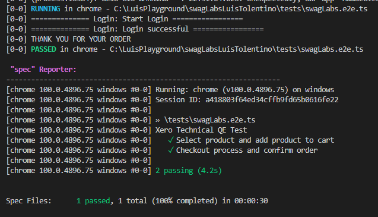

# Description

This project will cover the technical assessment for the technical quality engineer role at Xero.

<b> Author: </b> Luis Tolentino<br>
<b> Automation test framework:</b> Webdriverio - [link](https://webdriver.io/) <br>
<b> Programming language:</b> Typescript - [link](https://webdriver.io/)<br>
<b> Video clip (test execution): Clip - [link](https://vimeo.com/702503923/9d568b46ca)<br>
## Prerequisites
- Node JS <br>
[Download node js](https://nodejs.org/en/download/)
- Java <br>
[Download java](https://www.oracle.com/java/technologies/downloads/)
- VS Code <br>
[Download VS Code](https://code.visualstudio.com/download)
- Google Chrome browser <br>
[Download Chrome](https://www.google.com/chrome/?brand=CHBD&gclid=Cj0KCQjwpImTBhCmARIsAKr58czQSpT3-QDPHjNmSkrduvZOgIOSx11nVLBXp_2fdfJxQIi3rbI3jMYaAnk9EALw_wcB&gclsrc=aw.ds)

#### How to check if node is installed in your local machine - run command from terminal:
```bash
npm --version
```


## Setup

1. Install node dependecies for the project:
    Run command from root.
    ```bash
    npm ci
    ```
    At the end you should see the dependencies successfully installed.<br>

2. Create a <b> .env file </b> with your environment password.<br>
  <br>
  
  Create a .env file in the root directory and copy paste below.
  ```
  .env
  testpassword=secret_sauce
  ```

## Run Tests

Run this command to execute your automation test suites:
```bash
npm run test
```

Results should display which test steps passed or failed.<br>


### To run your test with headless mode

Simply comment out headless in the wdio.cont.ts file.<br>
<br>


## Continuous integration (CI)
CI pipeline should run on every commit. You should see the logs under the project/actions.<br>
Github actions workflows: [link](https://github.com/tolentinoluis/swagLabsLuisTolentino/actions)<br>


